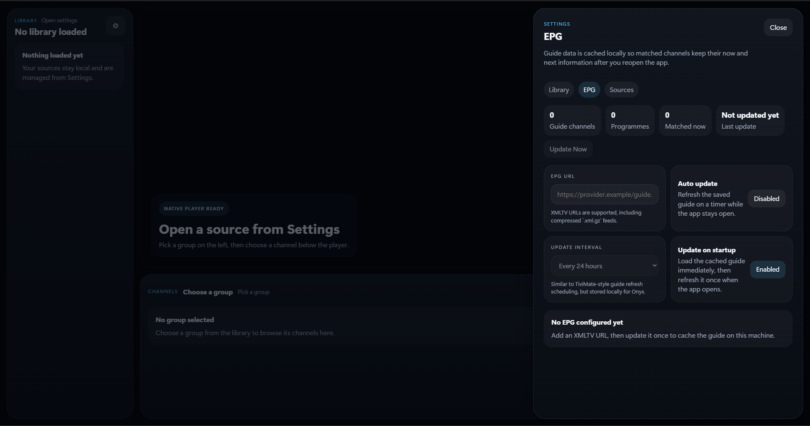

# Onyx

Onyx is a local-first Windows IPTV player with native `libmpv` playback, saved source profiles, favorites, recents, and multi-source XMLTV EPG support in a desktop interface built for browsing and watching instead of juggling raw playlist links and browser tabs.

Built with Tauri, React, and TypeScript.

Windows is currently the primary supported platform.

## Download

Download the latest Windows installer from [GitHub Releases](https://github.com/Guts444/Onyx/releases).

If you install Onyx from a release build:

- you do **not** need Rust
- you do **not** need Node.js
- you do **not** need to manually install the mpv DLLs

Those requirements only apply if you want to build Onyx from source.

## Features

- Sources that stay organized: import local `.m3u` / `.m3u8` files, remote M3U playlist URLs, and Xtream accounts, then switch between saved source profiles without re-entering everything each time.
- A better browsing library: browse channels by group, keep Favorites pinned, revisit Recents, hide noisy groups, search faster, and collapse the current source from the sidebar.
- EPG you can actually control: load one or more XMLTV guides, enable or disable each guide independently, refresh them on demand or on a schedule, and manually match channels when automatic lookup is not enough.
- Native playback that feels like a desktop app: `libmpv` playback with reload, stop, mute, volume, fullscreen, and startup restore for the last channel and volume.

## Screenshots

### Clean home screen

Open Settings, add a source, and start browsing without a crowded layout slowing you down.


### Settings tabs

The Settings drawer keeps Library, EPG, and Sources side by side so you can manage browsing, guide data, and saved logins from one place.

| Library | EPG | Sources |
| --- | --- | --- |
|  |  |  |

## Privacy

Onyx has no cloud backend, analytics, telemetry, or account sync.

Your playlists, Xtream details, guide settings, favorites, recents, and playback preferences stay on the device running the app.

## Security

- Playlist metadata is treated as untrusted text and rendered without HTML injection.
- Stream URLs are normalized and restricted to supported protocols or local file paths.
- Remote URL imports and XMLTV guide imports are fetched in Rust to avoid browser CORS limitations.
- No shell execution is driven by playlist data.

## Disclaimer

Onyx is a client application for loading and playing user-supplied playlists, streams, guide URLs, and related credentials. It does not provide any channels, playlists, stream URLs, guide data, or service access.

Users are responsible for ensuring they are authorized to use any playlists, streams, Xtream accounts, credentials, EPG URLs, and other third-party services or content loaded by Onyx, and that their use complies with applicable law and the terms of the relevant provider.

Onyx is not affiliated with, endorsed by, or responsible for third-party content or services loaded by users.

## Build From Source

You need:

- Node.js
- Rust
- Tauri prerequisites
- local `libmpv` binaries in `src-tauri/lib/`

Install dependencies:

```bash
npm install
```

Set up the local `libmpv` files expected by Tauri:

```bash
npx tauri-plugin-libmpv-api setup-lib
```

Or place these files in `src-tauri/lib/` yourself:

- `libmpv-wrapper.dll`
- `libmpv-2.dll`

Start development mode:

```bash
npm run tauri dev
```

Or double-click:

- `Start Onyx Dev.cmd`

If you only run `npm run dev`, the app opens in a browser preview and native playback will be disabled.

For release builds, the DLLs only need to exist locally when you build. The Tauri bundle config includes them as resources, so when they are present during the build they are bundled into the installer.

To build a release:

```bash
npm run tauri build
```

Or double-click `Build Onyx Release.cmd`.

Release artifacts are generated in:

```text
src-tauri/target/release/bundle
```

## Donations

If you're enjoying this project, please consider donating. It helps me continue improving it and spending more time on updates, fixes, and new features.

Bitcoin:

```text
3LYX3oEDCzz5S7oQjPmYQYi7ZGoA5XpCdM
```

Ethereum:

```text
0x1246dFAf32E435d79689852A3304ca384A73c1cb
```

Solana:

```text
Aqm2mLHikyZ5guTf7pKcaXjNXG69ifrDRY2324h79ony
```

Thank you for the support.

## License

This project is licensed under the MIT License.
