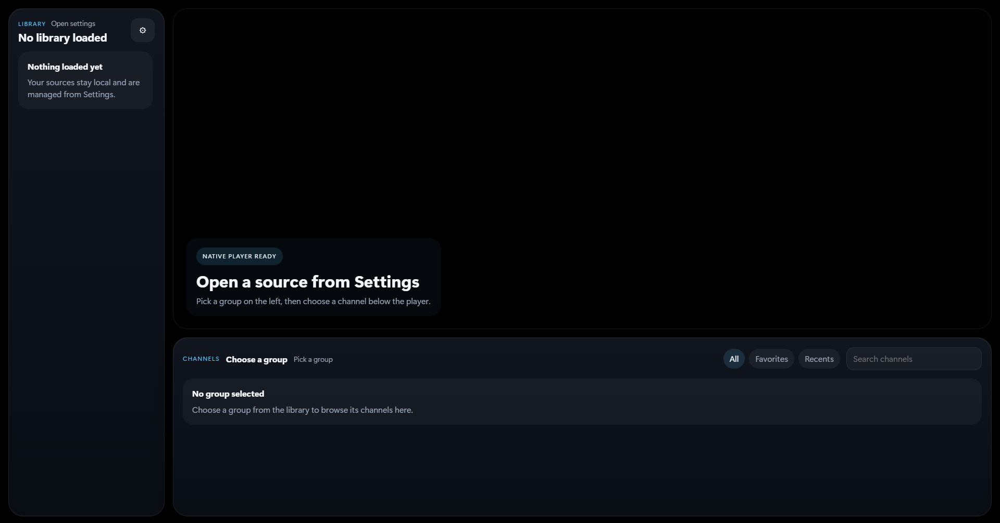
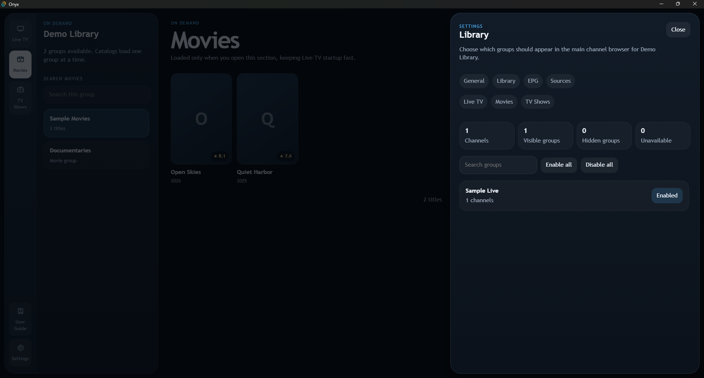
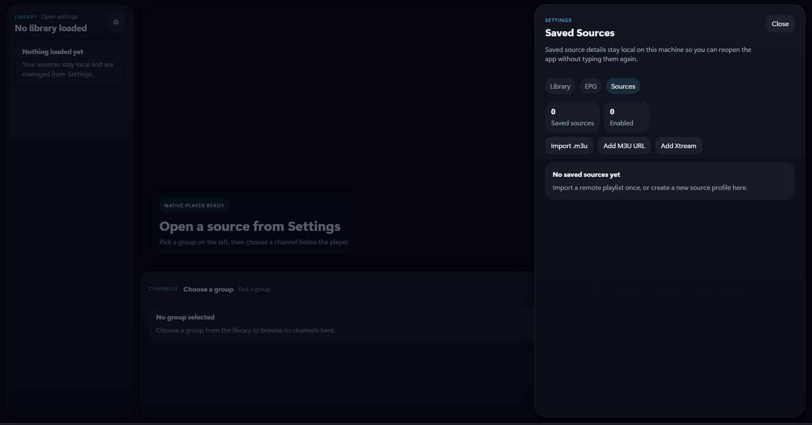

# Onyx

Onyx is a local-first Windows IPTV player with native `libmpv` playback, saved source profiles, favorites, recents, multi-source XMLTV EPG support, and a cleaner browsing experience than raw playlist links and browser tabs.

Built with Tauri, React, and TypeScript.

Windows is the primary supported platform.

## Download

Download the latest installer from [GitHub Releases](https://github.com/Guts444/Onyx/releases).

If you install Onyx from a release build:

- you do **not** need Rust
- you do **not** need Node.js
- you do **not** need to manually install the mpv DLLs

Those requirements only apply if you want to build Onyx from source.

## Why Onyx

- Native playback through `libmpv`
- Local `.m3u` / `.m3u8` import
- Remote M3U URL import
- Xtream live login import
- Multi-source XMLTV EPG integration
- Manual per-channel EPG matching with saved mappings
- Per-guide EPG refresh controls with update now, auto update, and update on startup
- Pinned Favorites group
- Library-wide Recents view
- Saved source profiles
- Resume last channel and volume on startup
- Group visibility controls and group search
- Local-only storage for personal data

## Screenshots

### Clean home screen

Onyx keeps the first-run experience simple: open Settings, add a source, and start browsing without a crowded layout.



### Library controls

Hide noisy groups, search large playlists faster, and keep the sidebar focused on the groups you actually want to browse.



### Saved sources

Add M3U files, remote M3U URLs, or Xtream accounts once and reopen them later without retyping everything every time you launch the app.



## Privacy

Onyx does not use a cloud backend, analytics, telemetry, or account sync.

Saved M3U URLs, Xtream details, EPG settings, guide mappings, favorites, recents, and playback/session preferences stay on the machine running the app.

## Features

- Sources: import local playlist files, remote M3U playlist URLs, and Xtream accounts, then save multiple source profiles locally.
- Library: browse channels by group, keep Favorites pinned at the top, view Recents across the whole loaded source, hide noisy groups, search groups, and collapse the current source from the sidebar.
- EPG: load one or more XMLTV guides, enable or disable each guide independently, refresh them on demand or on a schedule, manually match channels when automatic lookup is not enough, and keep those matches after restarting the app.
- Player: native `libmpv` playback with reload, stop, mute, volume, and fullscreen controls, plus startup restore for the last channel and volume.

## Local Data

Onyx stores this locally on your machine:

- saved M3U URLs
- saved Xtream credentials
- saved EPG sources and per-guide refresh settings
- saved EPG channel mappings
- cached guide data per source
- favorites
- recents
- last selected channel
- resume playback state
- remembered volume

That data is stored by the app locally, not in the tracked source files in this repository.

## Security

- Playlist metadata is treated as untrusted text and rendered without HTML injection.
- Stream URLs are normalized and restricted to supported protocols or local file paths.
- Remote URL imports and XMLTV guide imports are fetched in Rust to avoid browser CORS limitations.
- No shell execution is driven by playlist data.

## Disclaimer

Onyx is a client application for loading and playing user-supplied playlists, streams, guide URLs, and related credentials. It does not provide any channels, playlists, stream URLs, guide data, or service access.

Users are responsible for ensuring they are authorized to use any playlists, streams, Xtream accounts, credentials, EPG URLs, and other third-party services or content loaded by Onyx, and that their use complies with applicable law and the terms of the relevant provider.

Onyx is not affiliated with, endorsed by, or responsible for third-party content or services loaded by users.

## Build From Source

You need:

- Node.js
- Rust
- Tauri prerequisites
- local `libmpv` binaries in `src-tauri/lib/`

Install dependencies:

```bash
npm install
```

Set up the local `libmpv` files expected by Tauri:

```bash
npx tauri-plugin-libmpv-api setup-lib
```

Or place these files in `src-tauri/lib/` yourself:

- `libmpv-wrapper.dll`
- `libmpv-2.dll`

Start development mode:

```bash
npm run tauri dev
```

Or double-click:

- `Start Onyx Dev.cmd`

If you only run `npm run dev`, the app opens in a browser preview and native playback will be disabled.

For release builds, the DLLs only need to exist locally when you build. The Tauri bundle config includes them as resources, so when they are present during the build, they are bundled into the installer.

To build a release:

```bash
npm run tauri build
```

Or double-click `Build Onyx Release.cmd`.

Release artifacts are generated in:

```text
src-tauri/target/release/bundle
```

## License

This project is licensed under the MIT License.
